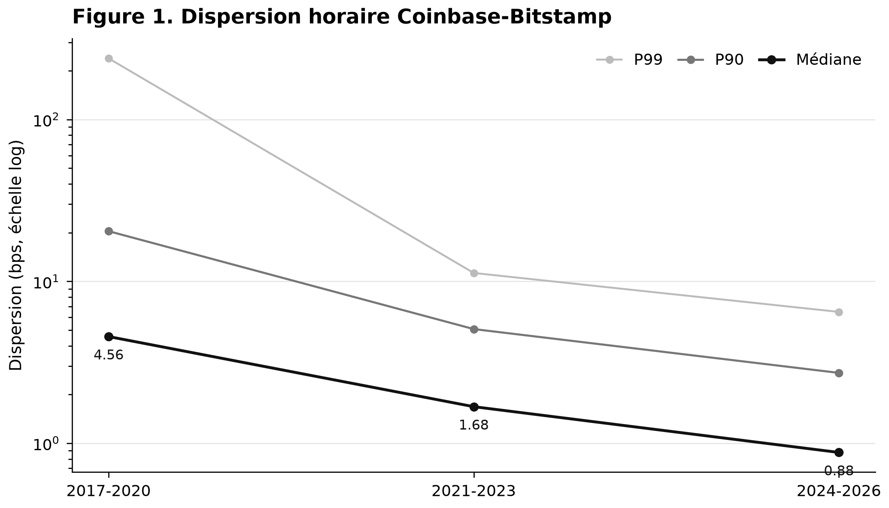
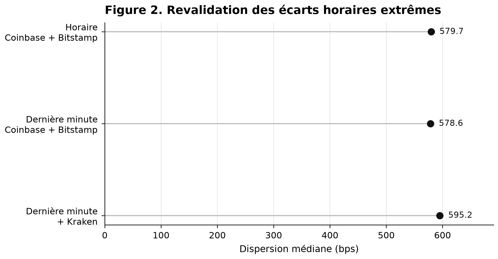
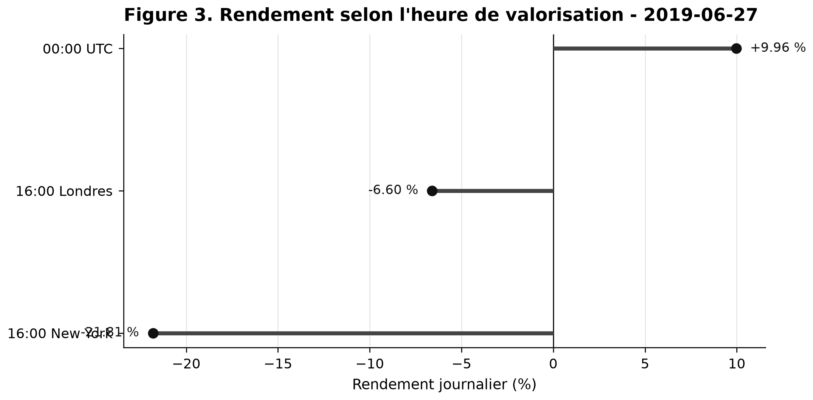
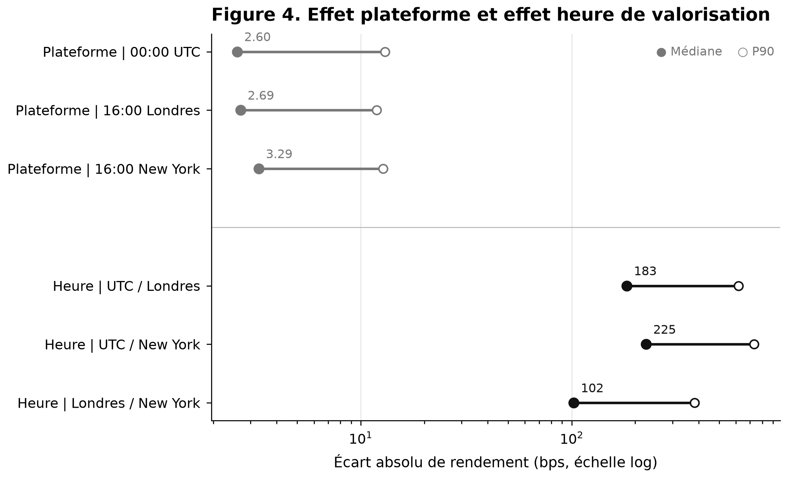
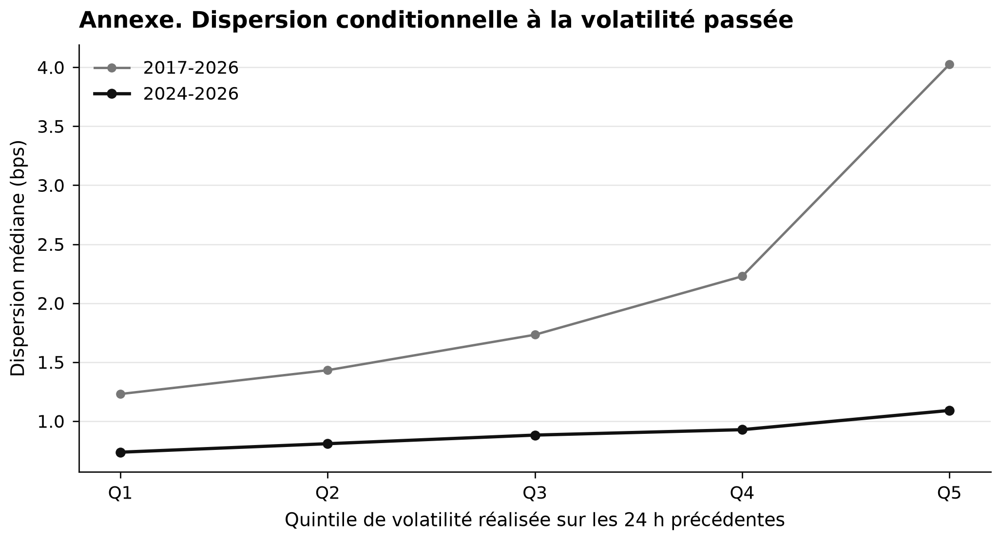

# Bitcoin Price Reference Study

[](https://github.com/Hilmar-Corp/HC-btc-price-reference-study/actions/workflows/research-assurance.yml)


**Reproducible multi-venue empirical study of Bitcoin price dispersion, valuation cut-offs and reference-price construction.**

This repository contains the research pipeline, controlled evidence, validation framework and publication figures supporting HilmarCorp's study of Bitcoin price-reference construction.

The central distinction is:

> Markets form prices. A methodology constructs a reference.

Bitcoin trades continuously across multiple venues. Unlike an exchange-traded security with a designated closing auction, Bitcoin has no universal end-of-day boundary imposed by the asset itself.

A daily reference therefore depends on explicit methodological choices including:

- venue selection;
- timestamp convention;
- observation window;
- aggregation rule;
- filtering and missing-data treatment.

## Research questions

The study evaluates four questions:

1. How large are BTC/USD price differences across major venues?
2. Do historically extreme cross-venue gaps survive narrower-window and third-source validation?
3. How much does the measured daily return change when the valuation boundary changes?
4. Is cross-venue dispersion descriptively associated with prior market volatility?

The study does **not** attempt to identify a unique "true" Bitcoin price.

The research composite used in parts of the analysis is not represented as an official benchmark.

## Final assurance

The frozen research bundle passes the consolidated assurance framework.

| Control domain | Status |
|:--|:--|
| Historical source capability | Validated |
| Recent source capability | Validated |
| Coinbase hourly coverage | Validated |
| Bitstamp hourly coverage | Validated |
| Common hourly sample | Validated |
| Dispersion consistency | Validated |
| Extreme-gap three-source revalidation | Validated |
| Extreme-gap minute persistence | Validated |
| Valuation-boundary sample | Validated |
| Missing-boundary control | Validated |
| DST sensitivity | Validated |
| Strict-calendar RV24 sensitivity | Validated |
| Full-sample volatility monotonicity | Validated |
| Recent-period volatility monotonicity | Validated |
| Controlled artifact inventory | Validated |
| Consolidated decision | **PASS — 16/16** |

The framework is fail-closed: a failed required control prevents a passing consolidated decision.

## Data scope

Primary research period:

**17 August 2017 to 10 August 2026**

Primary venues:

- Coinbase BTC-USD;
- Bitstamp BTC/USD.

Kraken BTC/USD is used as an independent third source for minute-level revalidation of selected historical extreme events.

### Hourly panel

| Metric | Result |
|:--|--:|
| Expected hours | 78,744 |
| Coinbase observations | 78,699 |
| Coinbase coverage | 99.943% |
| Bitstamp observations | 78,744 |
| Bitstamp coverage | 100.000% |
| Common observations | **78,699** |

No interpolation or forward filling is used to manufacture unavailable observations.

## Main results

### Cross-venue dispersion

Across the 78,699 common hourly observations:

| Statistic | Dispersion |
|:--|--:|
| Median | **1.88 bps** |
| P90 | **9.06 bps** |
| P95 | **15.70 bps** |
| P99 | **87.54 bps** |
| Maximum | **897.43 bps** |

Median dispersion declines materially across the study subperiods:

| Period | Median dispersion |
|:--|--:|
| 2017–2020 | 4.56 bps |
| 2021–2023 | 1.68 bps |
| 2024–2026 | **0.88 bps** |



### Extreme-gap validation

The 40 largest hourly dispersion observations were selected for diagnostic revalidation.

**39/40** were successfully revalidated at one-minute resolution with Coinbase, Bitstamp and Kraken.

| Measurement | Median dispersion |
|:--|--:|
| Selected hourly observations | 579.68 bps |
| Final minute — Coinbase + Bitstamp | 578.60 bps |
| Final minute — Coinbase + Bitstamp + Kraken | **595.22 bps** |

Maximum three-source one-minute dispersion:

**994.79 bps**

This is an extreme-event diagnostic. It is not an estimator of routine market conditions.



### Valuation-boundary sensitivity

Three daily valuation conventions are evaluated:

- 00:00 UTC;
- 16:00 Europe/London;
- 16:00 America/New_York.

Local-clock boundaries are daylight-saving aware.

The complete-case daily sample contains **3,271 observations**.

| Comparison | Median absolute difference | P90 | Sign disagreement |
|:--|--:|--:|--:|
| UTC / London | 182.55 bps | 617.05 bps | 40.42% |
| UTC / New York | **225.33 bps** | 732.19 bps | **48.39%** |
| London / New York | 102.31 bps | 382.48 bps | 23.94% |

At a fixed valuation boundary, median Coinbase-Bitstamp return differences are only:

**2.60 to 3.29 bps**

Across the three valuation conventions, median daily-return dispersion is:

**284.06 bps**

The descriptive ratio between the median three-cutoff dispersion and median fixed-cutoff venue effect is approximately:

**105×**

This ratio is descriptive and is not presented as a structural constant.

Illustrative observation — 27 June 2019:

| Valuation boundary | Daily return |
|:--|--:|
| 00:00 UTC | +9.96% |
| 16:00 London | -6.60% |
| 16:00 New York | -21.81% |

The three values describe different 24-hour windows.





### Dispersion and prior volatility

The final volatility analysis uses the strictly preceding **24 calendar hours**.

The return ending in the current dispersion hour is excluded.

| Sample | Spearman | Q5/Q1 median-dispersion ratio |
|:--|--:|--:|
| Full sample | **0.305** | **3.27×** |
| 2024–2026 | **0.131** | **1.48×** |

The association remains monotonic but is materially weaker in the recent period.

This analysis is descriptive and does not establish causality.



## Methodology

For venue prices \(P_{i,t}\), define the research cross-venue median:

\[
M_t = \operatorname{median}(P_{1,t}, \ldots, P_{N,t})
\]

and cross-venue dispersion:

\[
D_t =
10^4
\frac{\max_i P_{i,t} - \min_i P_{i,t}}
{M_t}.
\]

For valuation boundary \(\tau\), the daily return is:

\[
r_t^{(\tau)}
=
\frac{P(t,\tau)}
{P(t-1,\tau)}
-1.
\]

This separates:

- **source effect** — different venues at the same valuation boundary;
- **boundary effect** — the same reference methodology at different valuation times.

## Research controls

The pipeline implements:

- UTC normalization;
- timezone-aware valuation boundaries;
- daylight-saving handling through IANA timezones;
- exact or explicitly bounded timestamps;
- no interpolation;
- no forward fill;
- no silent source fallback;
- deterministic exclusions;
- cross-source replication;
- independent Kraken revalidation of selected extreme events;
- strict-calendar lagged volatility;
- no current-hour information in prior-volatility construction;
- SHA-256 manifests;
- deterministic tests;
- analytical-core coverage gates;
- explicit fail-closed assurance.

## Repository structure

```text
.
├── .github/
│   └── workflows/
│       └── research-assurance.yml
├── artifacts/
│   ├── extreme_gap_validation/
│   ├── final_assurance/
│   ├── full_history_hourly/
│   ├── gate3_validation/
│   ├── hourly_dispersion/
│   ├── publication_figures/
│   ├── source_audit/
│   ├── valuation_boundary/
│   └── volatility_dispersion/
├── evidence/
│   └── repository_evidence.json
├── scripts/
│   └── research/
├── tests/
├── acquisition_protocol.json
├── research_contract.json
├── source_registry.json
├── DATA_NOTICE.md
├── REPRODUCIBILITY.md
├── RESEARCH_ASSURANCE.md
├── CITATION.cff
├── LICENSE
├── NOTICE
├── Makefile
├── pyproject.toml
└── requirements-ci.txt
```

## Installation

Controlled runtime:

**Python 3.12**

```bash
python3.12 -m venv .venv
source .venv/bin/activate

python -m pip install --upgrade pip
python -m pip install -r requirements-ci.txt
python -m pip check
```

## Local assurance

Run all static checks:

```bash
python -m ruff format --check scripts tests
python -m ruff check scripts tests
python -m compileall -q scripts tests
```

Run the complete deterministic test suite:

```bash
python -m pytest -q
```

Verify the frozen repository evidence:

```bash
python -m scripts.research.verify_repository
```

Run analytical-core coverage:

```bash
make coverage
```

Run the complete repository assurance sequence:

```bash
make assurance
```

A valid frozen bundle ends with:

```text
REPOSITORY ASSURANCE: PASS
CORE COVERAGE GATE: PASS
```

## Reproducibility

Two reproducibility layers are intentionally separated.

### Frozen-evidence verification

Anyone can verify:

- committed code;
- tests;
- SHA-256 manifests;
- derived artifacts;
- publication figures;
- final assurance state.

This does not require redistribution of third-party raw market data.

### Full empirical reconstruction

A complete reconstruction requires reacquiring the relevant exchange market data.

See:

`REPRODUCIBILITY.md`

## GitHub Research Assurance

Every:

- push to `main`;
- pull request;
- manual workflow dispatch

runs the `Research Assurance` workflow.

CI checks:

- controlled dependency installation;
- Ruff formatting;
- Ruff lint;
- Python compilation;
- complete deterministic tests;
- frozen SHA-256 evidence;
- consolidated 16/16 research decision;
- absence of tracked raw market-data caches;
- analytical-core line coverage;
- analytical-core branch coverage.

Minimum analytical-core gates:

- line coverage ≥ **85%**;
- branch coverage ≥ **75%**.

## Data and third-party rights

Raw third-party market data is intentionally excluded from the public repository.

Apache License 2.0 applies to HilmarCorp's original software and repository content.

It does **not** grant rights to third-party exchange datasets, APIs, trademarks or services.

See:

`DATA_NOTICE.md`

## Interpretation limits

This repository contains descriptive quantitative research.

The results:

- do not establish a unique true Bitcoin price;
- do not establish that the research composite is an official benchmark;
- do not establish that volatility causes cross-venue dispersion;
- do not predict future returns;
- do not establish trading profitability;
- do not constitute investment advice;
- are conditional on the selected venues, period and methodologies;
- may evolve as market structure changes.

## Research governance

The repository is designed to preserve:

- reproducibility;
- source traceability;
- explicit assumptions;
- deterministic exclusions;
- controlled evidence;
- independent source validation;
- versioned analytical outputs;
- fail-closed assurance;
- resistance to unsupported editorial claims.

## Citation

Citation metadata is available in `CITATION.cff`.

## License

Apache License 2.0.

See `LICENSE` and `NOTICE`.

Third-party market data is outside the Apache-2.0 grant.

## Ownership

Copyright © 2026 HilmarCorp SAS.

Public quantitative research repository.

No investment advice.
